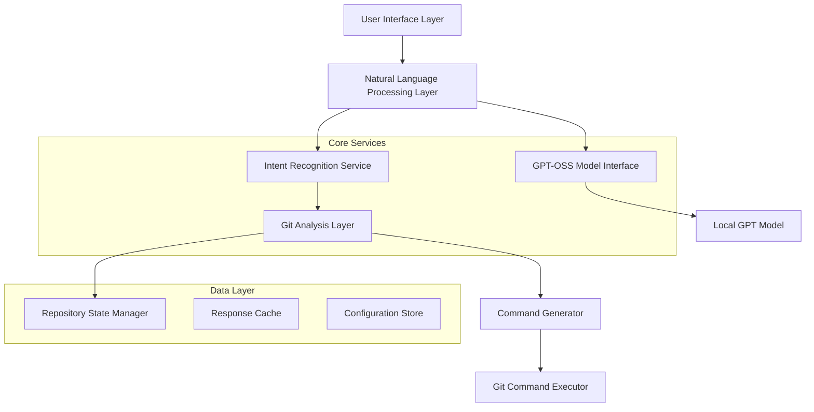

# Design Document

## Overview

The Intelligent Git Workflow Assistant is built as a modular system that combines Git repository analysis with open-source GPT models to provide natural language Git assistance. The system uses a local GPT-OSS model to understand user intent, analyze code changes, and generate appropriate Git commands and commit messages. The architecture prioritizes privacy by keeping all processing local and ensures fast response times through efficient model inference.

## Architecture

The system follows a layered architecture with clear separation of concerns:



## Components and Interfaces

### 1. Natural Language Processing Layer

**Purpose:** Handles user input processing and response generation using GPT-OSS models.

**Key Components:**
- `NLPService`: Main interface for natural language processing
- `PromptBuilder`: Constructs context-aware prompts for the GPT model
- `ResponseParser`: Extracts actionable commands from GPT responses

**Interface:**
```typescript
interface NLPService {
  processUserQuery(query: string, context: GitContext): Promise<AssistantResponse>
  generateCommitMessage(diff: GitDiff, options: CommitOptions): Promise<string>
  analyzePullRequest(changes: PullRequestData): Promise<PRAnalysis>
}
```

### 2. Git Analysis Layer

**Purpose:** Analyzes repository state and provides Git-specific context to the NLP layer.

**Key Components:**
- `GitStateAnalyzer`: Reads current repository state
- `DiffAnalyzer`: Analyzes code changes for semantic understanding
- `BranchAnalyzer`: Understands branching patterns and workflows

**Interface:**
```typescript
interface GitAnalysisService {
  getCurrentState(): Promise<GitRepositoryState>
  analyzeDiff(commitRange?: string): Promise<GitDiff>
  detectWorkflow(): Promise<WorkflowType>
  validateCommand(command: GitCommand): Promise<ValidationResult>
}
```

### 3. GPT-OSS Model Interface

**Purpose:** Manages interaction with the local GPT model for inference.

**Key Components:**
- `ModelManager`: Handles model loading and inference
- `PromptOptimizer`: Optimizes prompts for the specific GPT-OSS model
- `ResponseCache`: Caches responses for similar queries

**Interface:**
```typescript
interface GPTModelService {
  initialize(modelPath: string): Promise<void>
  generateResponse(prompt: string, options: InferenceOptions): Promise<string>
  isModelReady(): boolean
}
```

### 4. Command Generation and Execution

**Purpose:** Translates AI suggestions into executable Git commands with safety checks.

**Key Components:**
- `CommandBuilder`: Constructs Git commands from AI suggestions
- `SafetyValidator`: Validates commands for destructive operations
- `CommandExecutor`: Executes Git commands with proper error handling

## Data Models

### GitRepositoryState
```typescript
interface GitRepositoryState {
  currentBranch: string
  stagedFiles: FileStatus[]
  unstagedFiles: FileStatus[]
  untrackedFiles: string[]
  remotes: Remote[]
  recentCommits: Commit[]
  conflictedFiles?: string[]
}
```

### AssistantResponse
```typescript
interface AssistantResponse {
  interpretation: string
  suggestedCommands: GitCommand[]
  explanation: string
  warnings?: string[]
  alternatives?: GitCommand[]
}
```

### GitCommand
```typescript
interface GitCommand {
  command: string
  args: string[]
  description: string
  riskLevel: 'safe' | 'moderate' | 'destructive'
  requiresConfirmation: boolean
}
```

## Error Handling

### Model Inference Errors
- **Timeout handling:** Implement configurable timeouts for model inference
- **Fallback responses:** Provide basic Git help when model is unavailable
- **Graceful degradation:** Fall back to rule-based suggestions if AI fails

### Git Operation Errors
- **Command validation:** Pre-validate all Git commands before execution
- **State verification:** Verify repository state before destructive operations
- **Rollback capability:** Provide undo suggestions for reversible operations

### User Input Handling
- **Ambiguity resolution:** Ask clarifying questions for unclear requests
- **Context preservation:** Maintain conversation context for follow-up questions
- **Input sanitization:** Validate and sanitize all user inputs

## Testing Strategy

### Unit Testing
- **Component isolation:** Test each service independently with mocked dependencies
- **Model mocking:** Mock GPT responses for consistent testing
- **Git simulation:** Use test repositories for Git operation testing

### Integration Testing
- **End-to-end workflows:** Test complete user scenarios from input to execution
- **Model integration:** Test with actual GPT-OSS model in controlled environment
- **Repository scenarios:** Test various Git repository states and configurations

### Performance Testing
- **Model inference speed:** Measure and optimize response times
- **Memory usage:** Monitor memory consumption during model operations
- **Concurrent requests:** Test handling of multiple simultaneous requests

### Safety Testing
- **Destructive command prevention:** Verify safety checks for dangerous operations
- **Data integrity:** Ensure no data loss during Git operations
- **Permission validation:** Test proper handling of repository permissions